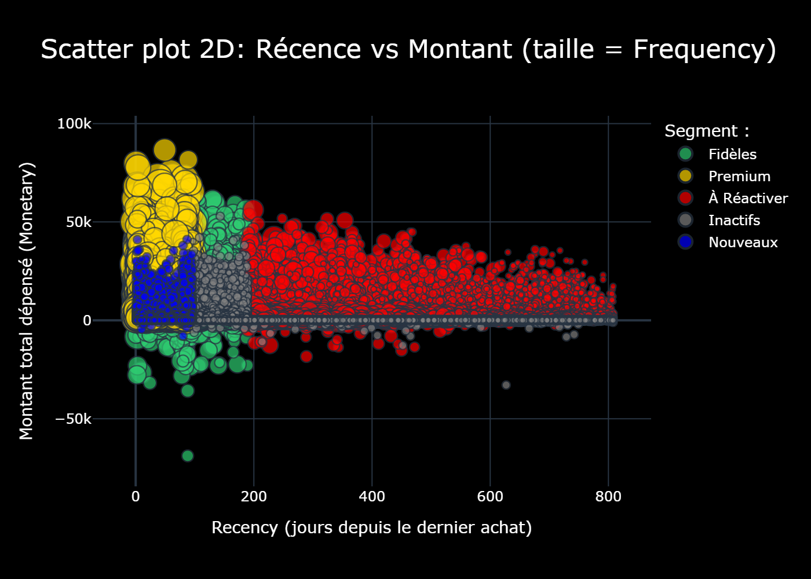

  

# RFM Segmentation

Ce projet vise à mettre en place une segmentation client basée sur les métriques RFM : Récence, Fréquence et Montant.  
L’analyse a été réalisée sur un jeu de données de ventes contenant plus de 6 millions de lignes.

L’objectif principal est d’identifier des groupes de clients distincts pour améliorer le ciblage marketing, optimiser les campagnes et proposer des actions adaptées à chaque profil.

## Contenu du projet

- `RFM_clean.ipynb` : notebook principal contenant les étapes de traitement, de scoring et de visualisation.
- `clean_notebook.py` : fonction utilitaire pour nettoyer un notebook (variables et sorties).
- `Scatter_plot_fx.py` : fonction pour créer un scatter plot 2D avec plotly 
- `Output/` : dossier contenant les visualisations statiques au format PNG et le scatter plot interractif (html).

## Visualisations

Les graphiques ont été réalisés avec la librairie Plotly (graphiques interactifs).  
Note : ces visualisations ne s’affichent pas directement sur GitHub, car elles sont au format HTML.  
Vous pouvez les visualiser en téléchargeant le notebook ou via ce lien:  https://gsdigger01.github.io/RFM-Segmentation/. 

## À noter

- Les segments RFM sont définis selon des règles simples et orientées métier.
- Plusieurs versions statiques des graphiques sont disponibles pour faciliter la lecture.
  
### **Aperçu des segments de client**
  

## Impacts
Grâce à cette segmentation RFM optimisée, nous pouvons déjà identifier des profils clients clés permettant un ciblage marketing plus pertinent et efficace. Chaque segment révèle des comportements d’achat spécifiques , qu’il s’agisse des clients Premium, des Fidèles, des Nouveaux acheteurs, des clients à réactiver ou des Inactifs.

Cette classification permet d’adapter les actions marketing à la réalité terrain, en déployant des stratégies ciblées :  

- Récompenses et exclusivités pour les Premium  
- Programme de fidélisation pour les clients réguliers  
- Parcours d’onboarding pour les nouveaux  
- Campagnes de relance pour les clients à réengager  
- Maîtrise des coûts marketing pour les segments peu engagés  
Cela se traduit par une meilleure efficacité des campagnes, une réduction des coûts d’acquisition et de rétention, et une amélioration de la satisfaction client par des communications plus personnalisées et utiles.  

Enfin, cette analyse peut servir de base pour des initiatives plus avancées, comme un système de recommandation intelligent, capable de prédire les préférences produits de chaque profil client et d’automatiser les propositions commerciales personnalisées. Ce type d’approche ouvre la voie à une stratégie de marketing prédictif orientée valeur client.  

⚠️ Disclaimer :
All datasets used in this project are synthetic and fictitious, created for educational and demonstrative purposes .

👤 Author :
Developed by FRANCIS NOGO – Analytics Engineer
